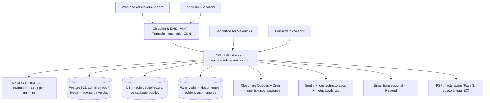

# Propuesta de arquitectura, stack y plan de trabajo — Ad Mavericks One

**Preparado para:** Ad Mavericks (equipo de negocio, desarrollo, infraestructura y seguridad)
**Fecha:** 12 de agosto de 2026
**Basado en:** Handoff técnico Ad Mavericks One (12-08-2026), Manual de marca v1.0 (ago-2026) y documento de contexto "Agencias y centrales de medios".
**Estado:** Documento de decisión (ADR base). Sujeto a confirmar las decisiones de negocio del §7.

> Este documento responde a cuatro preguntas: (1) arquitectura y stack final, (2) plan de trabajo, fases y estimación, (3) accesos, infraestructura y migración de datos, y (4) seguridad, respaldos y observabilidad. No contiene credenciales, identificadores de cloud, tarifas ni datos licenciados; esos se entregan por gestor de secretos, nunca por correo o chat.

---

## 0. Marco y principios que guían las decisiones

Antes de la técnica, tres restricciones que provienen del negocio y de la marca y que condicionan toda la arquitectura:

1. **No somos "una IA que compra sola".** La plataforma combina reglas, inventario, tarifas, métricas y revisión humana. La disponibilidad y las condiciones comerciales se confirman antes de una compra vinculante. Esto obliga a un modelo transaccional con reservas, confirmación de proveedor y auditoría — no basta con un flujo visual de aprobación.
2. **Honestidad de la medición.** Reach solo se combina con mismo universo/target/geografía/período/licencia; nada de sumar GRP, OTS, ranking, circulación o followers. Cuando no hay fuente homologada, el sistema muestra "pendiente de homologación", nunca `0%` ni un número inventado. Esta regla es parte del contrato de datos, no un detalle de UI.
3. **Los datos licenciados y las reglas comerciales nunca viven en el cliente.** Ni en el bundle web, ni en el móvil, ni en repos públicos, ni en logs. El navegador puede mostrar y calcular de forma visual; la API es la única fuente de verdad para permisos, licencia, presupuesto, catálogo vigente y disponibilidad.

El objetivo de la ingeniería es pasar de un **MVP operativo apto para demos asistidas** a una **plataforma multiempresa, persistente, segura y apta para dinero real**, sin abrir accesos externos ni procesar pagos hasta completar los bloques P0 y P1.

---

## 1. Propuesta de arquitectura y stack final

### 1.1 Decisión de arquitectura

Conservamos **Cloudflare como borde y hosting** (ya está la inversión y encaja), pero separamos con claridad cinco planos que hoy están mezclados: **borde/seguridad, identidad, API versionada, datos transaccionales y almacenamiento de objetos.**



### 1.2 Stack final recomendado

| Capa | Decisión final | Por qué / alternativa |
| --- | --- | --- |
| **Frontend / SSR** | Mantener **Next.js 16 · React 19 · TypeScript 5.9** sobre **Vinext/Vite** en **Cloudflare Workers** | Ya funciona y es apropiado; el cambio es de datos e identidad, no de framework. |
| **Borde / seguridad** | **Cloudflare**: DNS, WAF, Turnstile, rate limiting, CDN, DDoS, R2, Queues, Cron | Formaliza lo que hoy es una CSP mínima + headers en el Worker. |
| **Identidad (OIDC/SSO)** | **WorkOS** | Orientado a B2B: SSO por dominio corporativo, alta por invitación tras contrato, directorio y auditoría. *Alternativa:* Clerk (mejor DX) o Auth0/Entra si un cliente grande lo exige. |
| **Base de datos transaccional** | **PostgreSQL administrado — Neon** como **fuente de verdad** | Transacciones, integridad referencial, locking/optimistic locking, branching para staging, PITR. Driver HTTP compatible con Workers. *Alternativa:* Supabase (trae auth+storage), Cloud SQL o RDS según preferencia del equipo. |
| **Caché de lectura** | **Cloudflare D1** solo para catálogo público / lectura | D1 deja de ser la capa transaccional; queda como caché de baja latencia. |
| **ORM / migraciones** | **Drizzle ORM** apuntando a Postgres + **drizzle-kit** con **tabla de control de migraciones** | Reutiliza el conocimiento actual; se elimina la creación de esquema "defensiva" en runtime. |
| **Almacenamiento de objetos** | **Cloudflare R2 privado** con **uploads firmados** | Documentos, evidencias y montajes; allowlist MIME/tamaño + escaneo antimalware. |
| **Validación** | **Zod** con **contratos tipados compartidos** (`brief`, `plan`, `catalog`, `quote`, `order`) | Un solo esquema para cliente y servidor; el servidor siempre revalida. |
| **Jobs / colas** | **Cloudflare Queues + Workers Cron** | Importadores de catálogo, notificaciones, expiración de reservas. |
| **Email transaccional** | **Resend** | Invitaciones, aprobaciones, alertas. *Alternativa:* Postmark. |
| **Observabilidad** | **Sentry** (errores) + **logs estructurados** vía Logpush a **Axiom/Better Stack** + métricas y alertas | Con scrub de PII y datos comerciales. |
| **PSP / facturación (Fase 3)** | Decisión de negocio abierta. Candidatos en Ecuador: **Kushki / PayPhone / Datafast**, con **facturación electrónica SRI** | Sujeto a estructura legal y tributaria (§7). No se implementa hasta P1 cerrado. |
| **Móvil** | **Capacitor 8** + **OIDC Auth Code + PKCE** + token en **Keychain/Keystore** | Ya hay scaffold nativo; falta login real, API móvil, deep links y firma. |
| **Gestor de paquetes / runtime** | **pnpm 11.7**, **Node ≥ 22.13** | Sin cambios. |

### 1.3 Contrato de API (v1)

Toda la API se mueve a `/api/v1` (o `api.one.ad-mavericks.com`) con estos requisitos **obligatorios en cada endpoint de escritura**:

- Autorización **por acción, organización y recurso** (no solo "usuario logueado").
- **Validación de payload con Zod** + tamaño máximo + allowlist de content-type.
- **`Idempotency-Key`** en reservas, órdenes, pagos y webhooks.
- **`If-Match`/ETag o versión explícita** para edición concurrente de planes (preserva el `409 Conflict` actual).
- **Request/correlation ID** y errores normalizados sin detalles internos.
- **Rate limit** por usuario, IP, organización y endpoint sensible.

Endpoints núcleo (resumen): `auth/session`, `me`, `organizations/:id`, `catalog/*`, `plans/*` (con `recommendation`, `quote`, `approve`), `reservations/*`, `orders/*`, `uploads/sign`, `webhooks/:provider`.

### 1.4 Refactor de frontend imprescindible

`platform-demo.tsx` concentra demasiado estado y lógica comercial. Antes de crecer:
1. Extraer `plan-service` / `recommendation-service` en el servidor.
2. Definir contratos tipados compartidos.
3. Mantener componentes de UI puros (sin reglas comerciales duplicadas por pantalla).
4. **Feature flags por medio y por cliente** para liberar módulos de forma segura.

---

## 2. Plan de trabajo, fases y estimación

**Supuesto de equipo para la estimación:** 2 desarrolladores full-stack + apoyo parcial de DevOps/seguridad y un referente de negocio/medios para validaciones. Con un equipo mayor, las fases 2 y 3 se paralelizan y el calendario se comprime.

| Fase | Objetivo | Alcance principal | Estimación (2 devs) |
| --- | --- | --- | --- |
| **F0 — Descubrimiento y ADR** | Cerrar decisiones y preparar terreno | Elegir OIDC, Postgres, R2, correo, observabilidad, PSP; modelar permisos/organizaciones/proveedores/compras/retención; inventariar y clasificar fuentes/licencias; preparar entornos, DNS, secretos, IaC y plan de migración | **1–2 semanas** |
| **F1 — Seguridad y cuenta (P0)** | Habilitar accesos reales de forma segura | OIDC + invitaciones + MFA + RBAC por organización/recurso; migrar usuarios/licencias/planes a Postgres; API v1 con sesiones, auditoría y aislamiento multiempresa; panel interno de organizaciones/asientos; pruebas de autorización | **4–6 semanas** |
| **F2 — Catálogo y cotización controlada** | Datos comerciales gobernados | Backoffice de proveedores/tarifas/inventario/revisiones; importadores con validación humana; cotizaciones versionadas; optimizador a *line items* reales ("nunca dejar saldo" con brecha explícita); reservas con TTL, bloqueo transaccional e idempotencia | **5–7 semanas** |
| **F3 — Órdenes, recaudo y móvil (P1)** | Compra vinculante y distribución | Órdenes, aprobación por monto y doble aprobación, portal de proveedor, notificaciones; recaudo/mandato, conciliación, ledger, facturación y webhooks firmados (con validación legal/tributaria EC); API móvil, PKCE, deep links, Keychain/Keystore y QA en dispositivos | **6–10 semanas** |

**Total orientativo:** ~**16–25 semanas** (≈ **4–6 meses**) con solapes entre F2 y F3.

**Precondiciones no negociables:** identidad, permisos y modelo transaccional (F0–F1 y motor de reservas de F2) deben estar listos **antes** de cualquier compra real o cobro. No se abre a usuarios finales ni se procesa dinero con el estado actual.

**Hitos de aceptación por fase (extracto):** aislamiento total entre organizaciones; un proveedor solo ve su inventario y sus órdenes; un plan guarda/restaura todos los medios (incluidos influenciadores) sin mezcla entre logins; dos ediciones simultáneas generan conflicto controlado; un plan aprobado conserva versión, aprobador, timestamp, line items y condiciones; no se duplica inventario ni se confirma orden sin disponibilidad validada; los datos licenciados no aparecen en bundles, logs ni móvil; backups y restauración probados; SAST, escaneo de dependencias y pentest aprobados antes de habilitar pagos.

---

## 3. Requerimientos de accesos, infraestructura y migración de datos

### 3.1 Accesos (entregar por gestor de secretos / password manager, usuario individual y rol mínimo)

- Cloudflare (desarrollador, rol mínimo — no contraseña compartida).
- DNS de `ad-mavericks.com` y `one.ad-mavericks.com`.
- Repositorio Git privado y estrategia de ramas.
- Cuentas de: **WorkOS** (OIDC), **Neon** (Postgres), **R2**, **Sentry** + store de logs, **Resend**.
- Sandboxes de **PSP/facturación** cuando llegue el recaudo (Fase 3).
- **Apple Developer** y **Google Play Console** en la fase móvil.

### 3.2 Documentación operativa a recibir (bloquea negocio, no código)

- Matriz de roles y personas autorizadas por cliente/proveedor.
- Políticas de aprobación por monto y responsable.
- Contratos/licencias de **Kantar, Instar, TGI, InfoMedia** y cada proveedor: qué se puede **almacenar, mostrar, exportar** y **por cuánto tiempo**.
- Política de actualización de tarifarios/inventario y responsable de validación.
- Flujos de orden de compra, factura, comisión, compensación y recaudación/mandato.
- Política de retención y eliminación; privacidad y términos aprobados por asesoría legal ecuatoriana.
- Lista de **dominios corporativos autorizados** (`@lettera.ec`, `@cresa.com.ec`, etc.) y proceso de alta/baja.

### 3.3 Infraestructura y entornos

Tres entornos completamente aislados (base, secretos, logs y bucket separados):

| Entorno | Uso | Regla |
| --- | --- | --- |
| **Local** | Desarrollo | Datos sintéticos; nunca bases licenciadas completas. |
| **Staging** | QA y UAT | Dominio separado, identidad de prueba, datos anonimizados o con permiso explícito. |
| **Producción** | Clientes | Aislamiento total. |

Provisionar con **IaC**, secretos fuera del repositorio, y credenciales de despliegue con privilegios mínimos. Aprovechar **Neon branching** para levantar staging desde una rama de datos.

### 3.4 Migración de datos (D1 → PostgreSQL)

**Origen (D1 actual):** `organizations`, `users`, `memberships`, `licenses`, `auth_events`, `media_plans`, `media_plan_versions`, `media_plan_events`.

**Estrategia:**
1. **Diseñar el esquema Postgres** normalizado (organizaciones, membresías múltiples, roles/permisos, planes con propietario/colaboradores, y las entidades transaccionales de catálogo, cotización, reserva, orden, factura, auditoría). Mantener **snapshots JSON por versión**, pero **normalizar** los conceptos transaccionales.
2. **Resolver limitaciones del modelo actual:** pasar de "un usuario → una organización" a **pertenencias múltiples**; sustituir el delimitador `workspace_key` + email de creador por `organization_id` + propietario + colaboradores + permisos de plan.
3. **ETL controlado y repetible:** exportar D1, mapear campos, **generar `organization_id`**, mapear `workspace_key`+creador → organización+propietario, y **preservar los números de versión** para no romper el control optimista (`If-Match`/ETag).
4. **Validación:** conteo de filas, integridad referencial y **prueba de restauración** antes del cutover.
5. **Cutover:** congelar escrituras, sincronizar el delta final, conmutar la API a Postgres y verificar. D1 queda **solo como caché de catálogo de lectura**.
6. **Migraciones versionadas** desde el día uno (drizzle-kit + tabla de control); se elimina la creación de esquema en runtime.

---

## 4. Recomendaciones de seguridad, respaldos y observabilidad

### 4.1 Seguridad — P0 (obligatorio antes de abrir accesos reales)

- [ ] Reemplazar la autenticación por **headers del hosting** (identidad de ChatGPT/Sites) por **OIDC/SSO + sesión propia**: cookies `HttpOnly`, `Secure`, `SameSite=Lax/Strict`; **nunca tokens en `localStorage`**. Retirar el bypass de owner por variable de entorno.
- [ ] **RBAC por organización y recurso** con roles: `platform_owner`, `platform_operator`, `org_admin`, `planner`, `approver`, `viewer`, `supplier_admin`, `supplier_operator`; **límite de aprobación por monto** y **doble aprobación** en alto valor. Cada llamada revalida usuario/organización/rol/membresía/asiento/licencia.
- [ ] **Migraciones versionadas + backups + prueba de restauración**.
- [ ] **Producción/staging/desarrollo separados** con datos y bases distintos.
- [ ] **Secret manager** con rotación, inventario y mínimo privilegio.
- [ ] **WAF, rate limit, Turnstile** en login/formularios y **protección DDoS**.
- [ ] **CSP estricta** (`default-src`, `script-src`, `connect-src`, `img-src`, `style-src`, `frame-ancestors`) revisando MapLibre, analítica y dominios de imágenes.
- [ ] **R2 privado + uploads firmados + allowlist MIME/tamaño + escaneo antimalware + cuarentena**.
- [ ] **Política de retención, exportación y eliminación** de planes/usuarios/documentos.
- [ ] **Revisión de dependencias, SAST y secret scanning** antes de cada release.
- [ ] Pruebas de **aislamiento entre clientes/proveedores**.

### 4.2 Seguridad — P1 (antes de compras y facturación)

- [ ] **Motor de reservas e inventario anti-duplicidad** (TTL, hold transaccional, idempotencia).
- [ ] **Aprobaciones por monto, auditoría inmutable y separación de funciones**.
- [ ] **Webhooks firmados e idempotentes** de proveedores/PSP.
- [ ] **Conciliación y ledger** de pagos/recaudo (el estado de una tarjeta no es contabilidad).
- [ ] **DPA, política de privacidad, matriz de subencargados y procedimiento de incidentes** conforme a asesoría legal ecuatoriana.
- [ ] **Pentest externo** y plan de remediación.

### 4.3 Cifrado y privacidad

- HTTPS/TLS + **HSTS** en producción; cifrado gestionado en reposo para DB y objetos; cifrado de campo/llave de aplicación para lo más sensible si el análisis de riesgo lo exige.
- **No incluir** bases de Kantar, TGI, Instar, InfoMedia ni tarifarios licenciados en bundle web/móvil ni repos públicos.
- **No enviar** brief, presupuesto, PII ni disponibilidad a herramientas de IA externas sin contrato, autorización y minimización.
- Auditoría de accesos: usuario, organización, rol, acción, recurso, resultado, IP/UA, request ID, fecha y hash de cambios — **sin** contraseñas, tokens, tarifarios completos ni PII innecesaria.

### 4.4 Respaldos y continuidad

- **PITR** (point-in-time recovery) del Postgres administrado y snapshots regulares.
- **Prueba de restauración periódica y verificada** (un backup no probado no cuenta como backup).
- **RPO/RTO** definidos por criticidad; documentar el runbook de recuperación.
- Backups **cifrados**, con retención acorde a la política legal, y separados por entorno.

### 4.5 Observabilidad

- **Error tracking** (Sentry) con **scrub de PII y datos comerciales**.
- **Logs estructurados:** request ID, organización, usuario **pseudonimizado**, ruta, latencia, estado (sin payloads sensibles).
- **Métricas:** login, error rate, latencia API, **conflictos de versión**, **reserva expirada**, **orden rechazada**, **webhook fallido**, **importación de catálogo**.
- **Alertas de seguridad:** aumento de fallos de login, 401/403, enumeración de recursos, exportaciones masivas y cambios de roles.

### 4.6 CI/CD (marco operativo)

```
pull request → typecheck → lint → tests unit/integración → build → SAST/dependency scan
→ despliegue staging → smoke/E2E + UAT → aprobación → producción → monitoreo/rollback
```
Comandos ya disponibles: `pnpm typecheck`, `pnpm lint`, `pnpm test`, `pnpm build`. El pipeline exige credenciales de despliegue con privilegios mínimos y secretos fuera del repo.

---

## 5. Regla de negocio crítica: "nunca dejar saldo" sin inventar

El motor puede distribuir el **100% del presupuesto planificado**, pero debe separar siempre: **presupuesto objetivo · monto cotizado · monto reservado · monto confirmado · monto facturado**. Si por mínimos o inventario no se puede cerrar la brecha, se devuelve una **brecha explícita** con tres alternativas (aumentar presión en productos elegibles, cambiar formato/proveedor, o liberar saldo para aprobación humana). **Nunca** se rellena con tarifas inventadas ni se mueve dinero entre medios sin registro y confirmación.

---

## 6. Coherencia con la marca (impacto en producto)

- El lenguaje explica la lógica comercial sin prometer resultados automáticos ("La disponibilidad se confirma antes de emitir la orden"), nunca "la IA encontró la pauta perfecta".
- **Mavi** acompaña progreso y logros; **no** aparece en errores graves, validaciones legales ni controles de compra.
- Accesibilidad **AA**, foco visible, objetivos táctiles ≥ 44 px, color nunca como único portador de significado — requisitos que entran en la definición de "terminado" de cada pantalla.

---

## 7. Decisiones de negocio pendientes (bloquean F0)

1. ¿Se aprueba **WorkOS** como proveedor OIDC (o se prefiere otro)?
2. ¿**PostgreSQL como fuente de verdad** (recomendado) o operar inicialmente con D1 asumiendo sus límites?
3. ¿Qué **PSP y estructura legal/tributaria** para recaudo y facturación en Ecuador?
4. ¿Cuándo pasa un plan de **"propuesta" a "orden vinculante"**?
5. ¿Qué **benchmarks** se muestran al cliente vs. solo al operador de Ad Mavericks?
6. ¿Cuál es la **tolerancia de saldo** de presupuesto y qué reglas permiten moverlo entre medios?

---

## 8. Primer paso recomendado

Cerrar el §7, provisionar entornos/secretos/DNS y arrancar la **F1 (identidad + migración a Postgres + RBAC + API v1)**, que es la precondición de todo lo demás. El desarrollador parte de:

```sh
cd 05_plataforma-marketplace-medios/producto-web
pnpm install && pnpm typecheck && pnpm lint && pnpm test && pnpm dev
```

Archivos de referencia inmediatos: `worker/index.ts`, `db/schema.ts`, `db/media-plans.ts`, `app/chatgpt-auth.ts`, `app/plan-persistence.ts`, `app/server-plan-snapshot.ts`, `mobile/README.md`, `mobile/docs/API_CONTRACT.md`.
